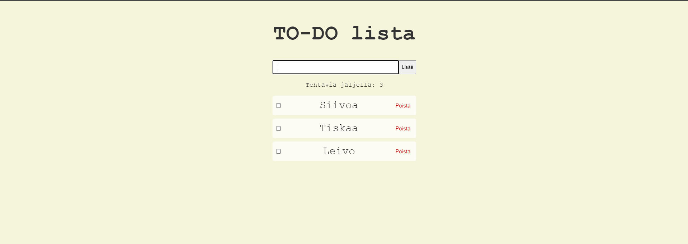

# Projektin nimi ja tekijät
TODO-lista, Leevi Saajoranta 

## Verkkolinkit:
Pääset julkaistuun sovellukseen käsiksi osoitteessa [google.com](https://google.com)
Linkki projektin videoesittelyyn [google.com](https://google.com)

## Työn jakautuminen 
Tein työn yksin joten työn jako meni tasaisesti minulle

## Oma arvio työstä ja oman osaamisen kehittymisestä
Mielestäni onnistuin visuaalisuudessa. Sivusto on simppeli, mutta selkeä
Parantamista olisi itse koodin kirjoittamisessa, se tuntuu vielä olevan hankalaa.
Sovelluksesta jäi puuttumaan local storage jota en jostain syystä saanut toimimaan.
Koen, että olen oppinut CSS käytön ja sisäistänyt hieman JS käyttöä
Antaisin itselleni pisteitä seuraavasti: 5/10 p

## Palaute opettajalle kurssista sekä itse opetuksesta tähän saakka
Kurssi on tuntunut rennolta josta pidän! Tykkään omaan tahtiin menemisestä ja se on sopinut itselle

## Sisällysluettelo:

- [Tietoja sovelluksesta](#tietoja-sovelluksesta)
- [Tunnetut virheet/bugit](#Tunnetut virheet/bugit)
- [Kuvakaappaukset](#kuvakaappaukset)
- [Teknologiat](#teknologiat)
- [Asennus](#asennus)
- [Kiitokset](#kiitokset)
- [Lisenssi](#lisenssi)

## Tietoja sovelluksesta
TODO-lista on sovellus, jolla voit kirjata ylös kaikki tehtävät jotka sinun pitäisi tehdä. Sovelluksessa voit kirjoittaa tehtävä ja lisätä sen listaan jossa voit joko poistaa tehtävän tai yliviivata tehtävän tehdyksi.

## Tunnetut virheet/bugit
Yritin tehdä local storagea, mutta se ei jostain syystä toiminut.

## Kuvakaappaukset

## Teknologiat
Kuvaa, mitä teknologioita käytettiin ja mikä oli niiden rooli projektissasi.  
Käytin seuraavia teknologioita: HTML, CSS ja JavaScript.

HTML: on peruspohjana sovellukselle

CSS: luo ulkonäön kuten värit, elementtien sijainnit ja koot.

JavaScript: tekee toiminnallisuudet, kuten nappien toiminnat.

## Asennus
Kirjoita lyhyet ohjeet sovelluksen käynnistämiseen ja käyttöön. Esimerkiksi:  
- lataa kaikki tiedostot ja avaa index.html selaimessasi  
- Sivuston keskellä näet tekstikentän johon voit kirjoittaa tehtävän
- Painamalla Enter näppäintä tai klikkaamalla Lisää painiketta voit lisätä tehtävän listaan
- Voit poistaa tehtävän painamalla Poista painiketta
- Voit yliviivata tehtävän painamalla tyhjää ruudukkoa tehtävän vieressä

## Kiitokset
Hyödynsin kurssin materiaalia sekä ChatGPT tekoälyä sovelluksen luomisessa. Tekoäly auttoi virheiden korjaamisessa ja sovelluksen ideoimisessa. Sen avulla löysin virheet ja opin mitä tehdä oikein. 

## Lisenssi
Valitse projektille lisenssi seuraamalla tätä [opasta](https://docs.github.com/en/communities/setting-up-your-project-for-healthy-contributions/adding-a-license-to-a-repository).

Esimerkki: MIT-lisenssi @ [tekijä](author.com)
